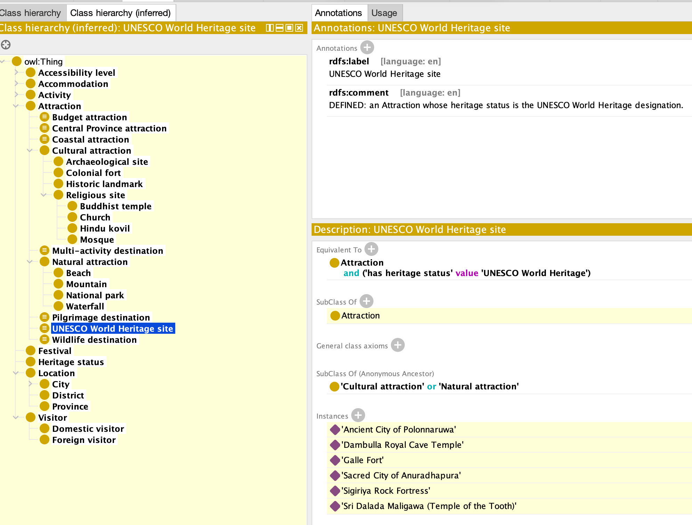

# Reasoning and Inference - evidence

## 1. Consistency check

| Check | Result |
|---|---|
| Reasoner | HermiT 1.4.3 (OWL 2 DL), invoked from Protégé 5.6 and from Owlready2 |
| Ontology consistent | **Yes** |
| Unsatisfiable classes | **None** - nothing appears under `owl:Nothing` |
| Asserted triples | 915 |
| Triples after classification and OWL RL closure | 2,503 |
| Facts the reasoner produced | **1,588** |

**Class hierarchy (inferred)** 


---

## 2. Inferred facts

Nine inferences follow. The assignment asks for five; each of these exercises a different OWL construct, so together they cover the whole modelling vocabulary used in the ontology. **None of them is asserted anywhere in the file** - verify by searching `srilanka-tourism.ttl` for the stated triple.

---

### Inference 1 - Province, via a property chain

**Derived:** `slt:SigiriyaRockFortress slt:locatedInProvince slt:CentralProvince`

**Axioms responsible**

```
slt:locatedInProvince  owl:propertyChainAxiom ( slt:locatedInCity
                                                slt:cityInDistrict
                                                slt:districtInProvince ) .
```

with the asserted chain

```
SigiriyaRockFortress  locatedInCity      Sigiriya
Sigiriya              cityInDistrict     MataleDistrict
MataleDistrict        districtInProvince CentralProvince
```

**Why it matters.** `locatedInProvince` is asserted for **no** individual in the ontology. Every one of the 15 province facts is computed. This is what makes CQ6 and CQ8 return zero rows without a reasoner.

---

### Inference 2 - Class membership from a `hasValue` restriction

**Derived:** `slt:SigiriyaRockFortress rdf:type slt:UNESCOWorldHeritageSite` (and five others)

**Axiom responsible**

```
UNESCOWorldHeritageSite ≡ Attraction ⊓ (hasHeritageStatus value UNESCOWorldHeritage)
```

Because this is a **necessary and sufficient** condition (`owl:equivalentClass`, not `rdfs:subClassOf`), the reasoner may work in the sufficient direction: satisfying the condition forces membership. Six sites classify: Sigiriya, Dambulla, Temple of the Tooth, Galle Fort, Anuradhapura, Polonnaruwa.

Had the class been written with `rdfs:subClassOf` instead, it would be **primitive** and the reasoner would classify nothing under it. This is the single most important distinction in the whole ontology.

---

### Inference 3 - Class membership stacked on top of a derived property

**Derived:** `slt:TempleOfTheTooth rdf:type slt:CentralProvinceAttraction`

**Axiom responsible**

```
CentralProvinceAttraction ≡ Attraction ⊓ (locatedInProvince value CentralProvince)
```

This inference depends on Inference 1 having fired first: `locatedInProvince` is itself derived. It shows the reasoner chaining derivations, not just reading asserted triples. Five attractions classify - Sigiriya, Dambulla, Temple of the Tooth, Horton Plains, Adam's Peak.

---

### Inference 4 - Qualified cardinality restriction

**Derived:** `slt:GalleFort rdf:type slt:MultiActivityDestination` (and nine others)

**Axiom responsible**

```
MultiActivityDestination ≡ Attraction ⊓ (offersActivity min 3 Activity)
```

Galle Fort asserts three `offersActivity` relationships - heritage walk, photography, cycling - and the `owl:AllDifferent` axiom over the activity individuals guarantees the three fillers are distinct. Without that axiom the open world assumption would allow the three names to denote the same activity and the count would not reach three.

Ravana Falls (one activity) and Dambulla (two) correctly stay out.

**Note:** this is the one inference outside the OWL RL profile. It requires HermiT, Pellet or FaCT++; a triple-store RL reasoner alone will not produce it.

---

### Inference 5 - Datatype restriction on a data property

**Derived:** `slt:DambullaCaveTemple rdf:type slt:BudgetAttraction` (and nine others)

**Axiom responsible**

```
BudgetAttraction ≡ Attraction ⊓ (entranceFeeLKR some xsd:decimal[< 2500])
```

The reasoner compares the asserted literal `2000` against the datatype facet `maxExclusive 2500`. Yala (4500), Horton Plains (4000), Sigiriya (10000), Anuradhapura and Polonnaruwa (7500) are excluded.

---

### Inference 6 - Inverse property

**Derived:** `slt:Sigiriya slt:hasAttraction slt:SigiriyaRockFortress`

**Axiom responsible:** `slt:locatedInCity owl:inverseOf slt:hasAttraction`

`hasAttraction` is asserted nowhere. The same mechanism produces `hasNearbyAccommodation` from `servesAttraction`, which is what CQ4's OPTIONAL block retrieves.

---

### Inference 7 - Symmetric property

**Derived:** `slt:DambullaCaveTemple slt:nearbyAttraction slt:SigiriyaRockFortress`

**Axiom responsible:** `slt:nearbyAttraction rdf:type owl:SymmetricProperty`

Only the Sigiriya -> Dambulla direction is written in the file. The reverse is free. Three pairs are asserted one-way; six facts exist after reasoning.

---

### Inference 8 - Transitive property with sub-properties

**Derived:** `slt:Sigiriya slt:withinArea slt:CentralProvince`

**Axioms responsible**

```
withinArea          rdf:type          owl:TransitiveProperty
cityInDistrict      rdfs:subPropertyOf withinArea
districtInProvince  rdfs:subPropertyOf withinArea
```

Each asserted `cityInDistrict` and `districtInProvince` fact is first promoted to `withinArea`, then transitivity closes city -> province. Note the deliberate design decision: `withinArea` carries the transitivity while the two specific properties stay **simple**, which keeps them legal as functional properties and keeps the ontology inside OWL 2 DL.

---

### Inference 9 - Subsumption up the taxonomy

**Derived:** `slt:SigiriyaRockFortress rdf:type slt:CulturalAttraction`, `slt:Attraction`

**Axioms responsible:** `ArchaeologicalSite ⊑ CulturalAttraction ⊑ Attraction`

The simplest inference in the set, and the one the assignment brief itself gives as an example. Only `ArchaeologicalSite` is asserted.

---

## 3. Summary table for the report

| # | Inferred fact | OWL construct | Reasoner needed |
|---|---|---|---|
| 1 | Sigiriya -> Central Province | `owl:propertyChainAxiom` | OWL RL or DL |
| 2 | Six sites are UNESCO World Heritage sites | `owl:equivalentClass` + `owl:hasValue` | OWL RL or DL |
| 3 | Five sites are Central Province attractions | equivalence over a derived property | OWL RL or DL |
| 4 | Ten sites are multi-activity destinations | `owl:minQualifiedCardinality` | **DL only** |
| 5 | Ten sites are budget attractions | `owl:withRestrictions` datatype facet | **DL only** |
| 6 | `Sigiriya hasAttraction SigiriyaRockFortress` | `owl:inverseOf` | OWL RL or DL |
| 7 | `Dambulla nearbyAttraction Sigiriya` | `owl:SymmetricProperty` | OWL RL or DL |
| 8 | `Sigiriya withinArea CentralProvince` | `owl:TransitiveProperty` + `rdfs:subPropertyOf` | OWL RL or DL |
| 9 | Sigiriya is a Cultural attraction | `rdfs:subClassOf` | RDFS or above |

---
